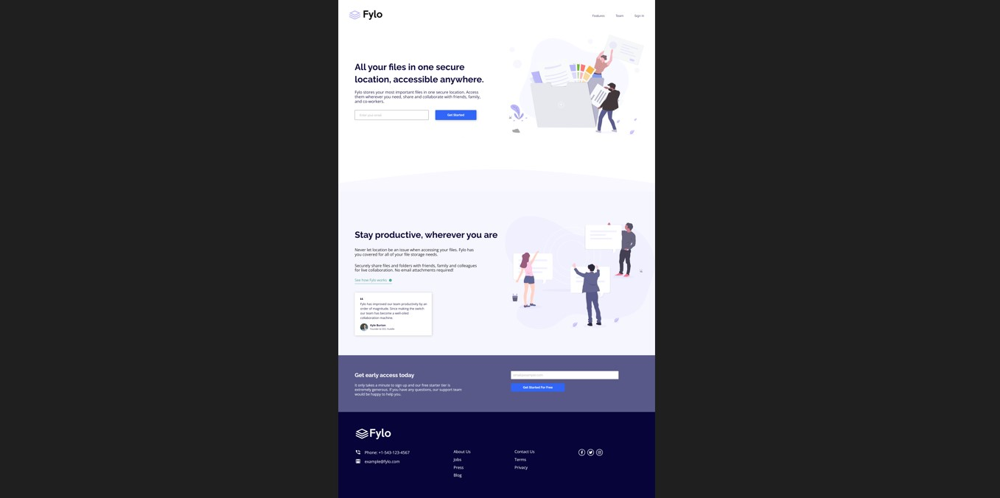
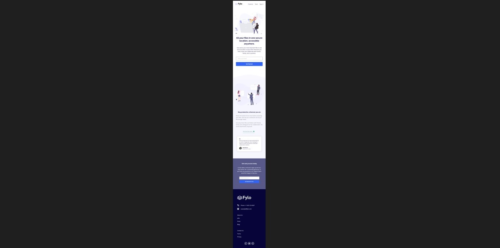

# Frontend Mentor - Página de inicio agrupada con solución de sección introductoria única

Esta es una solución a [Fylo landing page with two column layout challenge on Frontend Mentor](https://www.frontendmentor.io/challenges/fylo-landing-page-with-two-column-layout-5ca5ef041e82137ec91a50f5). Los retos de Frontend Mentor me ayuda a mantener frescos los conocimientos sobre frontend. En este ocación una práctica de HTML y CSS.

## Tabla de contenido

- [Descripción general](#overview)
  - [El reto](#the-challenge)
  - [Captura de pantalla](#screenshot)
  - [Enlaces](#links)
- [Mi proceso](#my-process)
  - [Construido con](#built-with)
  - [Que aprendí de nuevo](#what-i-learned)
  - [Desarrolo Continuo](#continued-development)
- [Autora](#author)

## Overview

### The challenge
Los usuarios deberían poder:

- Ver el diseño óptimo según el tamaño de pantalla de su dispositivo
- Ver estados hover para todos los elementos interactivos en la página
- Validación básica de email.

### Screenshot
- Diseño Desktop de 1440 de ancho.

- Diseño Mobile de 375 de ancho.

### Links

- URL de la solucion: [CHALLENGE-huddle-landing-page-with-single-introductory-section-master](https://ivatroth.github.io/CHALLENGE-huddle-landing-page-with-single-introductory-section-master/)

## My process

### Built with

- HTML5
- CSS custom properties
- Flexbox
- Flujo de trabajo: Mobile-first

### What I learned

Esta práctica me sirvió para reforzar conceptos y prácticas de HTML y CSS. 

### Continued development

Mi objetivo es fijar mucho más los conceptos básicos de la programación web, de tal manera que mi codificación en lo más básico sea intuitiva y rápida. Esto es solo el comienzo.

## Author

- Website - [Ivana Frontroth]https://ivanafrontroth-portfolio.vercel.app/)
- Frontend Mentor - [@ivatroth](https://www.frontendmentor.io/profile/Ivatroth)
- LinkedIn - [https://www.linkedin.com/in/ivana-frontroth/](https://www.linkedin.com/in/ivana-frontroth/)